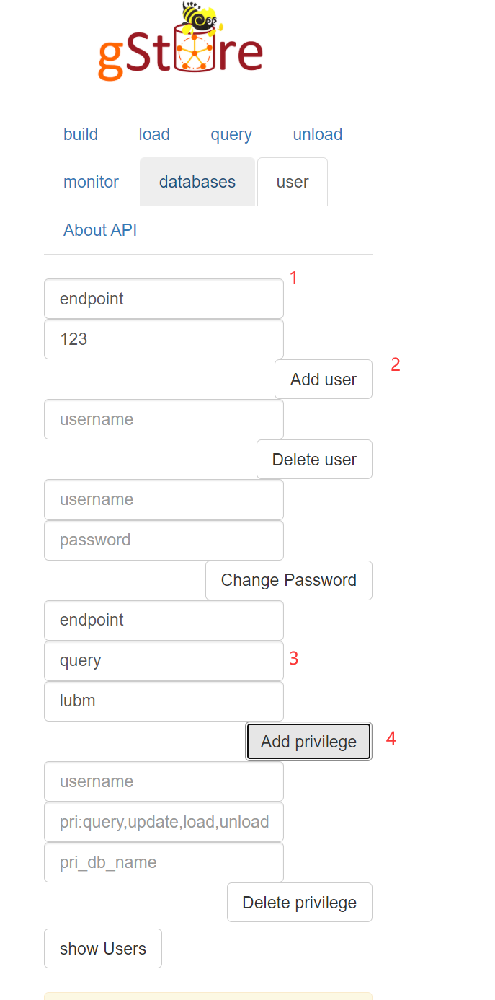

# graphweibo

由[gStore](http://gstore.cn/)驱动的社交网站。

# 部署

## 编译

不要使用docker部署，每次退出容器，都会使得容器的数据清空。我也懒得看文档里哪里有写数据文件等放在什么地方了。

安装文档在这里，还挺好用的： https://github.com/pkumod/gStore/blob/master/docs/INSTALL.md

总的来说就是下面几个命令：

```bash
# $(ARCH)替换成archlinux, centos和ubuntu之间的一个
# 装必要的软件
sudo ./scripts/setup/setup_$(ARCH).sh 

# 运行下面两个就行
make pre
make

# 最后运行一下make test
# 如果没有报错就安装成功了
make test
```

## 使用

```bash
# 以下所有命令都要在gStore的根目录执行，不要cd走

# 先构建一个数据库
# 使用./data/lubm/lubm.nt建立一个名字叫lubm的数据库
# 创建数据库就是这个格式
bin/gbuild lubm ./data/lubm/lubm.nt 

# 在这个数据库上运行服务器
bin/ghttp lubm

```

`bin/ghttp`运行时，在浏览器中访问http://localhost:9000可以进一个查询界面，但是这个界面的查询功能不能用，

http://gstore.cn/pcsite/detail.html?id=a5f272f0eb2811e9969a00163e04a303。

进这个网站： http://localhost:9000/admin.html ，使用admin和123456登录可以进入管理界面。

按照以下图示创建用户endpoint(密码123)和给予权限。以后创建了新数据库之后，也可以进这个界面给权限



这个之后就可以在localhost:9000上运行查询了。

## 正确退出

直接ctrl-c不能退出进程，使用`ps aux`找`bin/ghttp`的进程然后`kill {进程号}`杀掉。

## 在这个容器里运行第三次作业

